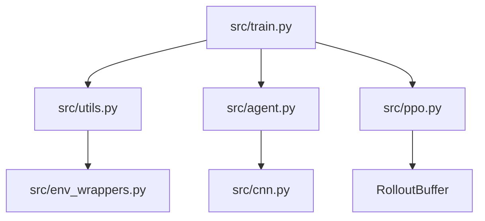

# Student Guide: Codebase Walkthrough

Welcome! This project is a custom implementation of **Proximal Policy Optimization (PPO)** designed to play Sonic the Hedgehog 2. Below is a map of how the different pieces of code work together.

## 🏗️ The Architecture
The project follows a standard Reinforcement Learning structure, but with custom "Sonic-specific" logic to make the agent smarter.

## 📄 File-by-File Guide

### 1. `src/train.py` (The Director)
This is the entry point. It handles the **Training Loop**:
- It manages and synchronizes 8 parallel Sonic games.
- It runs the **Rollout Phase** (playing the game) and the **Optimization Phase** (learning from the game).
- It includes safety features like GPU temperature monitoring.

### 2. `src/ppo.py` (The Logic)
This contains the mathematical core of the project:
- **`RolloutBuffer`**: A fast storage for game experiences.
- **`PPOAlgo`**: Implements the clipped objective that prevents the AI from "over-reacting" and breaking its own logic.

### 3. `src/agent.py` & `src/cnn.py` (The Brain)
- **`NatureCNN`**: A Convolutional Neural Network that "sees" the pixels and extracts features like "Sonic," "Rings," and "Hills."
- **`Agent`**: A "Two-Headed" network. One head (the **Actor**) decides which button to press, and the other (the **Critic**) predicts how many points the agent will get.

### 4. `src/env_wrappers.py` (The Training Wheels)
Raw Genesis games are hard for AI. We use "Wrappers" to make it easier:
- **`SonicRewardV18`**: Our custom "Score" function. Instead of just game score, we reward Sonic for moving right, building momentum, and spin-dashing! It includes local "Backtrack Credit" for loops and is hardened against "Momentum Farming."
- **`SonicDiscretizer`**: Simplifies the 12-button controller into 10 logical choices (Jump Right, Spin Dash, etc.).
- **`PyTorchFrameStack`**: Let's Sonic "see" 4 frames at once so he can perceive motion and speed.

## 🚀 Key Concepts to Study
1.  **Advantage Calculation**: Look at `compute_returns_and_advantages` in `ppo.py`. This is how the AI calculates if a move was "better than expected."
2.  **Reward Shaping**: Check `SonicRewardV18` in `env_wrappers.py`. Notice how we only reward high-speed momentum when the agent is near its personal 'frontier' (max progress) to prevent exploitation.
3.  **Orthogonal Initialization**: See `layer_init` in `agent.py`. This is a professional trick to make the AI start learning with a "balanced" mind.
