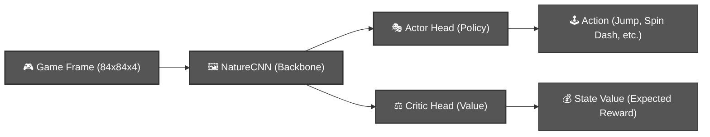

# 🦔 Sonic 2 PPO: From-Scratch Reinforcement Learning
> **A educational demonstrator of the PPO algorithm solving Emerald Hill Zone Act 1.**

This repository contains a modular, from-scratch implementation of **Proximal Policy Optimization (PPO)** in PyTorch. It is designed as a teaching tool for students and RL enthusiasts to see how a CNN-based agent learns to master the complex physics and fast-paced environment of *Sonic the Hedgehog 2*.

---

## ✨ Key Features

*   **🎓 Educational Focused**: Every file is heavily commented for beginners, explaining the *why* behind PPO losses, CNN kernel sizes, and Actor-Critic architectures.
*   **🏎️ Momentum Reward (V18)**: A sophisticated reward function that handles the "Run-up" logic needed for half-pipes and loops, while featuring an **Anti-Farming** fix to prevent exploitation.
*   **📺 Real-time HUD**: A specialized evaluation tool (`evaluate_hud.py`) that overlays the agent's real-time rewards, probability distribution (entropy), and action choices.
*   **💨 optimized Workflow**: Built with `uv` for lightning-fast dependency management and a specialized Git history that keeps the repo small (~0.2 MB) despite its history.
*   **🛡️ Safety First**: Built-in GPU temperature monitoring to protect hardware during long training sessions.

---

## 🚀 Getting Started

### 📋 Prerequisites
- **Python 3.10+** (Recommended: 3.11)
- **uv package manager**: `pip install uv`
- **Sega Genesis ROM**: You need the Sonic 2 ROM (`Sonic the Hedgehog 2 (JUE) [!].bin`).

### 📦 Installation
1.  **Clone & Sync**:
    ```bash
    uv sync
    ```
2.  **Import ROM**: Place your ROM in the `/ROMS` folder and run:
    ```bash
    python -m retro.import ROMS
    ```

---

## 🎮 How to Use

### 1. Training the Agent
To start the training process (uses 8 parallel environments by default):
```bash
uv run python src/train.py
```
*   **Checkpoints**: Saved to `models/checkpoints/`
*   **Logs**: View progress in real-time via Tensorboard: `tensorboard --logdir logs`

### 2. High-Quality Evaluation (HUD)
Watch the AI play with full diagnostic information overlaid on screen:
```bash
uv run python -m src.evaluate_hud --model models/best_model.pth
```

### 3. Victory Analysis
Quickly calculate victory rates and completion stats from your training logs:
```bash
uv run python -m src.count_victories --log-dir logs/Your_Run_Folder
```

---

## 🧠 Technical Deep Dive: The Brain

The agent uses a **Deep Q-Network style CNN** combined with the **PPO algorithm**. Here is how the pixels become actions:



---

## 📽️ Agent Spotlight
> [!NOTE]
> Below is a high-speed completion of Emerald Hill Zone Act 1 by our V18 agent.


---

## 🔮 Future Work: Multi-Level Mastery
Our current v18 model is a specialist in Emerald Hill Act 1. The next phase of this project will focus on:
- **Base Model Generalization**: Training on multiple zones (Chemical Plant, Casino Night) simultaneously.
- **Curated Curriculum**: Implementing a training schedule that slowly increases level complexity.
- **Extend documentation**: add more comments and visualizations to explain code and algorithms in more detail.

---

## 📂 Project Navigation

*   **[src/ppo.py](src/ppo.py)**: The mathematical heart. Contains the RolloutBuffer and PPO Update logic.
*   **[src/env_wrappers.py](src/env_wrappers.py)**: The physics teacher. Defines the **reward** and game discretizers.
*   **[src/agent.py](src/agent.py)**: The brain. Connects the NatureCNN backbone to the Actor and Critic heads.
*   **[CODE_WALKTHROUGH.md](CODE_WALKTHROUGH.md)**: A deep dive into how the files connect for students.

---

## 🏁 Results
After ~10 million steps, the agent consistently clears Emerald Hill Zone Act 1, handling the loops, the "s-curves," and the final signpost with speed and precision.

> [!TIP]
> This project was built for learning! Feel free to tweak the **Entropy Coefficient** in `train.py` or the **Momentum Reward** in `env_wrappers.py` to see how it changes Sonic's behavior.

---

## ⚖️ Disclaimer

This project is for **purely educational and research purposes**. 

- **No ROMs Included**: This repository does not contain any copyrighted game binaries (ROMs). Users must provide their own legally obtained copy of *Sonic the Hedgehog 2* to run the experiments.
- **Fair Use**: The use of game footage and assets in this project is intended as a professional demonstration of Reinforcement Learning research.
- **Ownership**: *Sonic the Hedgehog* and all associated characters, graphics, and music are trademarks of **SEGA**. This project is NOT affiliated with or endorsed by SEGA.
